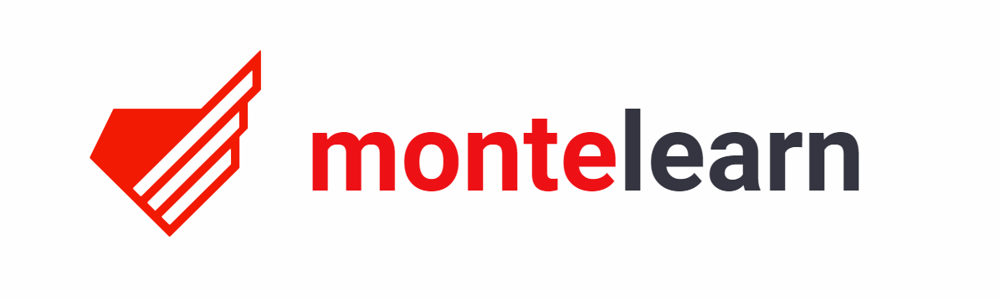

# montelearn: headless e-learning platform

Montelearn is a backend API that you can use to build a custom e-learning platform. Its main focus is on creating interactive lessons and tests, so it’s suitable for every kind of science or topic.

We decided to develop Montelearn and make it publicly available due to the COVID-19 pandemic. The educational system will inevitably gravitate towards the remote paradigm. We believe that the ability to use free, open-source, and proven solutions will greatly benefit schools that often operate on a tight budget.

Montelearn is a high-end software built on microservices. It’s elastic and highly customizable at its core. It can be made to fit virtually any frontend — see the documentation below.

## Use cases

Montelearn will be helpful in any scenario where interactive, choice-based workflows are needed. The use cases include, but are not limited to:

- School tests
- University courses
- Quizzes
- Research questionnaires
- Knowledge retention tools

## See it in action

To see Montelearn in action visit [https://montelearn.monterail.com](https://montelearn.monterail.com).

### White-labeling the demo

To make the implementation of Montelearn easier, we’re also giving full access to the demo’s frontend. You can freely modify it and brand it in your own way.

## Documentation — how to install

### Backend and Frontend

- [Backend documentation](./docs/BACKEND.md)
- [Frontend documentation](./docs/FRONTEND.md)

We welcome all contributors! If you want to jump in, simply do so and start creating pull requests.

## License

The Montelearn source code is completely free and released under the [MIT License](./LICENCE).
