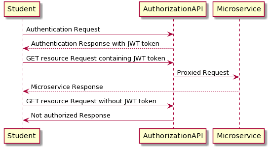

# monterail-elearning

# BE architecture
Backend architecture is constructed by microservices written in Django and Ruby on Rails.
The entrypoint to each of them is authentication-api which provides authentication and proxy service. 
The API is wrriten in Open API format and documented using Swagger.

- To access resources, the user (student) has to be authenticated.
- To add resources, the user (teacher) has to have is_teacher flag set to `is_teacher=True` in authentication-api.

# Prerequisites
- docker
- docker-compose

# Run BE microservices
In the main directory `monterail-elearning` run `make run` to start docker-compose.
Microservices with API documenentation provided by Swagger can be found on: 
- authentication-api: `http://0.0.0.0:8080/swagger/`
- lesson-api: `http://0.0.0.0:8000/swagger/`
- tests-api: `http://0.0.0.0:3000/swagger/`

Register your email address using POST authentication-api endpoint `/auth/email/register/` via Swagger.
Copy token and use it to authorize your request, using `Bearer <token>`
Route each request to microservice through `authentication-api`.

# Add lessons to database
- In the main directory `monterail-elearning` run `make lesson_load_data`

# Create developer account
- In the main directory `monterail-elearning` run `make auth_api_superuser`

# Create student account
- Register your email address using POST authentication-api endpoint `/auth/email/register/` via Swagger.
  Log in (via Swagger `http://0.0.0.0:8080/swagger/`) and use obtained credentials to GET lessons and tests.

# Create teacher account
- Register your email address using POST authentication-api endpoint `/auth/email/register/` via Swagger.
  Use developer account to login to developer admin page `http://0.0.0.0:8080/admin/`.
  Navigate to `Users`, choose the previously registered account and assign the teacher rights marking `is_teacher` as True.
  Log out and log in using teacher's credentials (via Swagger `http://0.0.0.0:8080/swagger`).
  Right now you are able to add/update lessons and tests.

# Cleanup docker containers
- In the main directory `monterail-elearning` run `make cleanup`

# Run and test microservices separately
Each BE microservice can be run and tested separately, please refer to README.md in the microservice directory. 

# Deployment
Changes to microservices are automatically deployed to Heroku (Github Actions) after a pull request is merged to `master` branch. It's worth pointing out that changes not related to particular microservice source code <u>does not trigger</u> a new deployment.

# IP Whitelisting
Lesson-api and tests-api have open, public APIs which can be hidden on production using IP whitelisting, which is currently implemented only in lesson-api.

# Lesson-api IP whitelist
In local environment all of the IPs are being allowed (`BASIC_AUTH_WHITELISTED_IP_NETWORKS=0.0.0.0/0`).
To whitelist IP on production set up an environment variable `BASIC_AUTH_WHITELISTED_IP_NETWORKS` and assign it range of allowed IP addresses.
To add multiple network ranges separate them by comma ex. ``BASIC_AUTH_WHITELISTED_IP_NETWORKS=127.0.0.0/8,10.0.0.0/8
